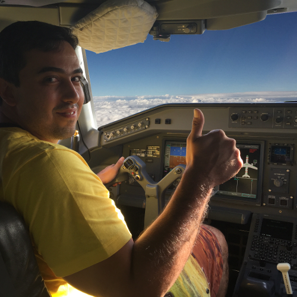

# Vin Busquet

Curious about the world around me, I'm Vin Busquet, and I have been investigating software development and architecture since 2009. Rewinding to the beginning of my work, I concentrated on safe video streaming solutions and cybersecurity, later moving into cryptocurrency. Yearning for new challenges, I've focused on AI and machine learning development and integration since 2017. Passionate about problem-solving, I enjoy puzzles, lifting weights, and rowing inside while listening to podcasts when I'm not designing a solution. There is always room for more fun, jazz, blues, and instrumental music are much appreciated, as are books, movies, and captivating series. I delve into the cleverness, from books like Sherlock Holmes to the futuristic worlds of Asimov. Curiosity and challenges are part of my driving forces. - Like the great captain Picard once said "Things are only impossible until they are not". As a life-long learner I try to stay updated. If you can solve the hidden puzzle here, we might share common interests.
